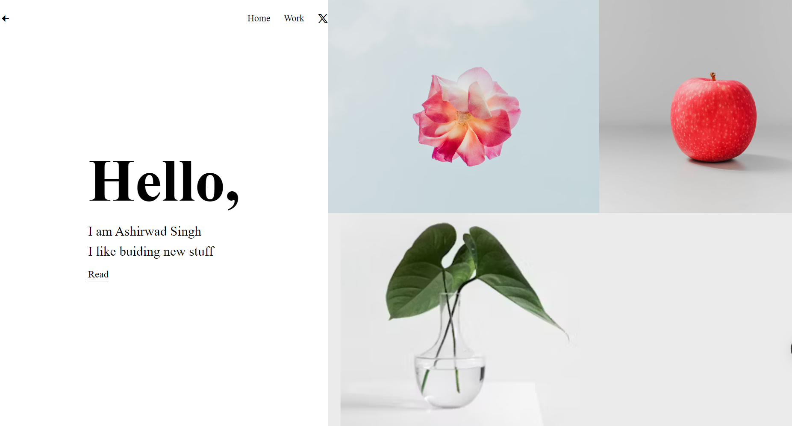

# Simple UI Design Project

## Overview
This project is a simple UI design project implemented using HTML and CSS. It showcases a basic webpage layout with some styling to make it visually appealing.

## Features
- Responsive layout that adapts to different screen sizes.
- Clean and minimalist design.
- Easy-to-understand HTML structure.
- CSS styling to enhance the visual appearance of the webpage.

## Project Structure
The project structure is organized as follows:
- `index.html`: Main HTML file containing the structure of the webpage.
- `styles.css`: CSS file containing the styling rules for the webpage.

## Usage
To view the webpage:
1. Clone the repository to your local machine.
2. Open the `index.html` file in your web browser.

## Credits
This project was created by Ashirwad Singh.
